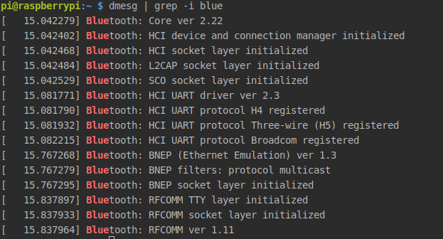
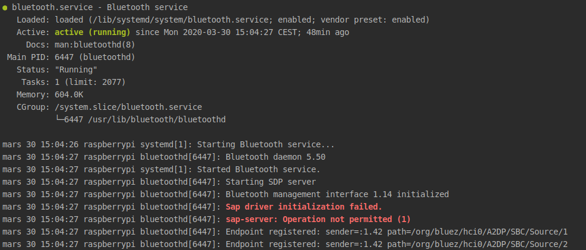

# La communication avec un autre microcontrolleur

La communication se fait par bluetooth. En temps normal, j'aurai certainement utiliser un esp32 qui communiquerait par BLE avec le Raspberry. Cependant, n'ayant pas tout le matériel nécessaire, j'ai dû utilisé un arduino avec un module Bluetooth qui ne supporte pas le BLE.

## Le but de la communication

Nous avons eu l'idée de la communication avec un autre microcontrolleur car la malette JoyPi posait problème sur plusieurs points : 

- La matrice de LEDs n'offrait pas assez de possibilités d'un point de vu couleur et affichage.

- La malette utilise la quasi totalité des GPIO du RPI (seul une reservé au servomoteur est libre).

Nous avons donc décidé d'utiliser un autre microcontrolleur qui pilotera une matrice de LEDs RGB. 

 ## Le module Bluetooth
 
 Le module bluetooth que nous avons utilisé est un HC-06.
 
 ## Notre protocole
 
 Pour facilité la modularité de notre application, voici le protocole que nous avons choisi : 
 
 Nous allons envoyer 64 couleurs à la suite qui correspondront aux 64 LEDS de la matrice RGB.
 Nous devrons donc envoyer 192 octets pour chaqu affichage.
 
 L'avantage de ce protocole est que c'est le raspberry qui controlera entièrement la matrice de LEDs RGB.
 
 # Le bluetooth du Raspbian
 
 Quelques commandes pour avoir des infos sur le Bluetooth et pour débugguer d'éventuelles erreurs...
 
 ### En regardant le journal de démarrage
 fi
 `dmesg | grep -i blue`
 
  
 
 ### En regardant le status du bluetooth
  
  `systemctl status bluetooth`
  
   
  
  L'échec au niveau du serveur d'accès SIM (SAP) n'est pas très important car permettre au RPi3 d'accéder à une carte SIM d'un téléphone compatible Bluetooth n'est pas le but du projet.