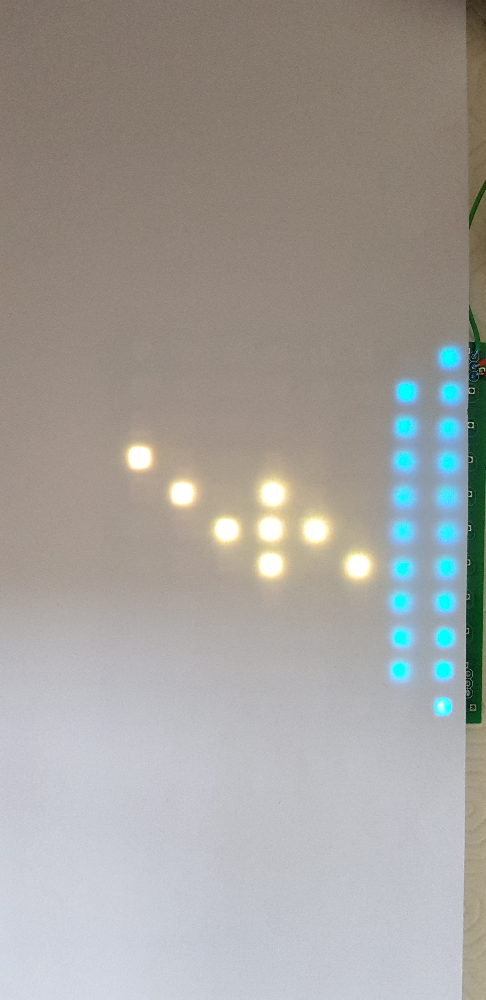

#BLUETOOTH

La librairie élaborée permet de piloter la matrice de LEDs qui est controlée par un Arduino.

Voici ce qu'elle permet de faire.

Attention! Il ne faut pas oublier d'apparer son module bluetooth avec le Raspberry avant d'utiliser la librairie. Il faudra également modifier la variable `char dest[18] = "00:12:05:11:94:92";` avec la bonne addresse de votre module.

## dessin d'un soleil

  

## dessin d'un nuage

  

## dessin de la pluie

 
 
 ## dessin de la neige
 
 

 ## dessin d'un éclair
 
 

