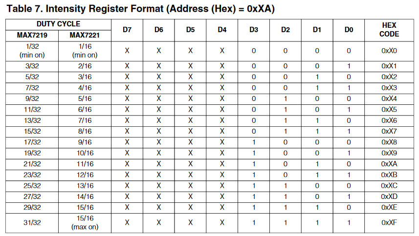
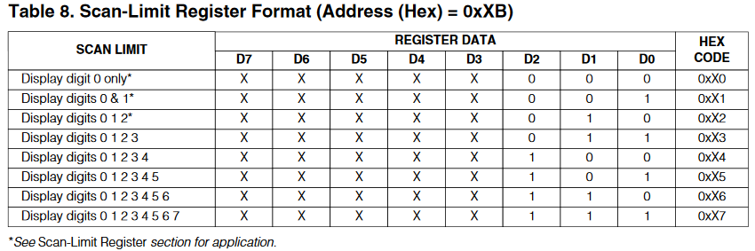

# **La Matrice de LED**
La matrice de LED présente sur la JOYPI est une matrice 8*8 avec des LED rouges. Elle est couplée avec un **MAX7219**, qui est un circuit intégré permettant le contrôle d'afficheur sept segments et de matrices de LED. Il permet d'utiliser 3 pins au lieu de 16 dans notre cas. Il y a donc un multiplexage derrière ce circuit intégré qui permet de contrôler autant de sortie! 

## La communication SPI!

Le MAX7219 utilise la communication SPI, qui est un protocole de transfert de données. Il a donc fallut trouver une librairie qui gère ce dernier. La librairie [WiringPi
](https://github.com/WiringPi/WiringPi) prend en charge ce protocole, nous avons donc choisi de l'utiliser. Nous avons donc dû comprendre les fonctions de la librairie pour l'implémenter.

## Files

### led_matrix_v1.c

Il s'agit de la première version de test. Dans ce programme, nous avons implémenté l'initialisation du MAX7219.

Voici comment nous l'avons configuré : 

 - **Configuration de la fonction "Decode Mode"**\
Le "decode mode" est surtout utile lorsque le MAX7219 est utilisé avec des afficheurs 7 segments, or, ici,  il est utilisé avec une matrice de LEDs, on ne veut donc pas que notre information soit 'interprétée'  mais plutôt que l'on affiche exactement ce que l'on veut afficher*

 - **Configuration de la fonction "Luminosité"**\
 Voici comment on règle la luminosité : 
 
 
 - **Configuration de la fonction "SCAN_LIMIT"**\
 Il a pour rôle de définir le nombre de digits que l'on souhaite exploiter de digit0 à digit8. En fonction du tableau 8 ci-dessous, il peut prendre huit (8) données sur trois (3) bits allant de 0xX0 à 0xX7 sélectionnant ainsi les digits de droite à gauche.
  

 - **Configuration de la fonction "SHUTDOWN"**\
 Il permet d'allumer (0x01) ou d'éteindre (0x00) la matrice.
 
